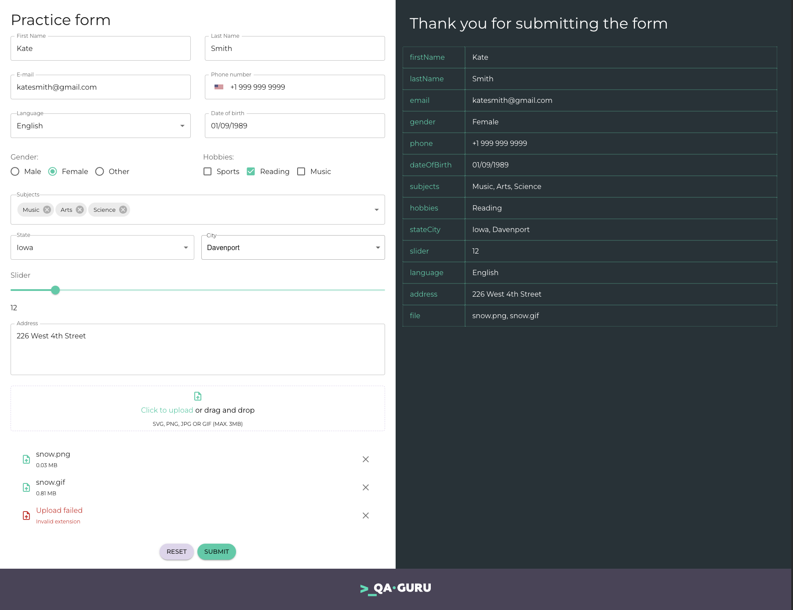

# Automation practice form

A modern student form to practice automation testing built with React and React Hook Form.



## 🛠 Technologies

- **React** - JavaScript library for building user interfaces.
- **React Hook Form** - Performant, flexible and extensible forms library for React Hooks.
- **Yup** - JavaScript schema builder for value parsing and validation.
- **Material UI** - A simple, customizable, and accessible library of React components.

## ✨ Features

– 📜 React Hook Form – Efficient form state management with validation and error handling
– ✅ Yup Validation – Schema-based form validation with custom error messages
- 📝 Diverse Input Fields – Includes text fields, select dropdowns, radio buttons, checkboxes, sliders, and drag & drop file upload
– 📤 Submit Handling – Submitted data is displayed in a structured format on the screen
– 🚀 Realistic Testing Scenario – Simulates real-world form filling with various input types
– ⚡ Responsive UI – Ensures proper display on different screen sizes.

## 🚀 Installation and Setup

1. Clone the repository:

```bash
git clone https://github.com/yourusername/automation-practice-form.git
```

2. Navigate to the project directory:

```bash
cd automation-practice-form
```

3. Install dependencies:

```bash
yarn
```

4. Start the development server:

```bash
yarn start
```

## 🔧 Available Scripts

- `yarn start` - Runs the app in development mode at http://localhost:3000
- `yarn test` - Launches the test runner in interactive watch mode
- `yarn run build` - Builds the app for production in the `build` folder
- `yarn run eject` - Removes the single build dependency from your project

## 🤝 Contributing

Contributions are welcome! Please follow these steps:

1. Fork the repository
2. Create your feature branch: `git checkout -b feature/new-feature`
3. Commit your changes: `git commit -m 'Add new feature'`
4. Push to the branch: `git push origin feature/new-feature`
5. Submit a pull request
